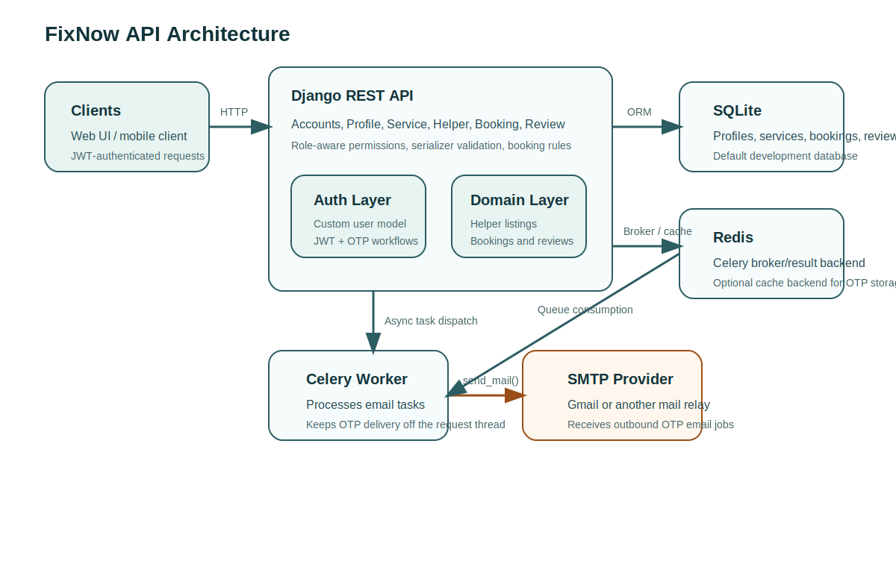
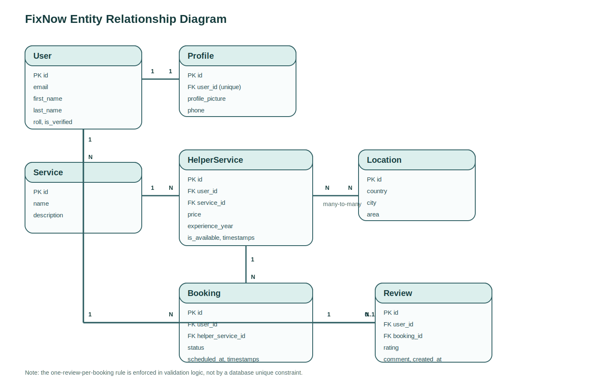

# FixNow API

FixNow is a Django REST API for a home-services marketplace. It supports role-based accounts, helper listings, service catalog management, bookings, reviews, profile management, and OTP-based account recovery flows.

## Project Overview

### Problem the project solves

The API connects service acquirers with service providers for on-demand home services such as plumbing, electrical work, cleaning, or appliance repair. It gives providers a way to publish the services they offer and gives customers a way to browse, book, and review those services.

### Core capabilities

- Email-first authentication with JWT tokens
- Role-aware accounts for service providers, service acquirers, and admins
- Auto-created user profiles
- Service catalog and helper-service listings
- Location-based helper availability and pricing
- Booking workflow with scheduling and status validation
- Post-completion reviews and helper rating aggregation
- OTP request and verification flow for recovery scenarios

## Architecture Diagram



## ERD



The model layer enforces a few domain rules in application code:

- A user cannot book their own helper service.
- A helper service cannot be double-booked for the same time when the booking is still pending or accepted.
- Reviews are only allowed after a booking reaches `Completed`.
- One review per booking is enforced in validation logic rather than a database unique constraint.

## Architecture Summary

### Backend

- Django 6 with Django REST Framework
- JWT authentication via `djangorestframework-simplejwt`
- Celery for background email delivery
- Redis as Celery broker/result backend
- SQLite as the default development database
- Django cache for OTP storage, with optional Redis-backed cache via `REDIS_CACHE_URL`

### App layout

- `Accounts/`: custom user model, signup, OTP, JWT, password reset
- `Profile/`: user profile and profile update endpoints
- `Service/`: admin-managed service catalog
- `Helper/`: helper service listings and supported locations
- `Booking/`: customer bookings and lifecycle validation
- `Review/`: ratings and reviews tied to completed bookings
- `FixNow/`: global settings, URL routing, Celery bootstrap

## API Endpoint List

Base URL in local development: `http://127.0.0.1:8000/`

### Authentication and Accounts

| Method | Endpoint | Purpose | Auth |
| --- | --- | --- | --- |
| `POST` | `/account/` | Register a new user | Public |
| `POST` | `/account/api/request-otp/` | Send an OTP to an existing user email | Public |
| `POST` | `/account/api/verify-otp/` | Verify OTP and issue JWT tokens | Public |
| `POST` | `/account/api/token/` | Get access and refresh tokens | Public |
| `POST` | `/account/api/token/refresh/` | Refresh access token | Public |
| `POST` | `/account/api/token/verify/` | Verify token validity | Public |
| `POST` | `/account/api/token/blacklist/` | Blacklist a refresh token | Public |
| `POST` | `/account/api/password-forget/` | Trigger OTP flow for password recovery | Public |
| `POST` | `/account/api/password-reset/` | Reset the current authenticated user's password | Bearer token |

### Profiles

| Method | Endpoint | Purpose | Auth |
| --- | --- | --- | --- |
| `GET` | `/profile/` | Retrieve the current user's profile | Bearer token |
| `PATCH` | `/profile/` | Update current profile data | Bearer token |
| `GET` | `/profile/<id>/` | Retrieve a profile by primary key | Bearer token |

### Services

| Method | Endpoint | Purpose | Auth |
| --- | --- | --- | --- |
| `GET` | `/service/api/` | List services | Authenticated service provider or admin |
| `POST` | `/service/api/` | Create a service | Admin |
| `GET` | `/service/api/<id>/` | Retrieve a service | Authenticated service provider or admin |
| `PUT/PATCH` | `/service/api/<id>/` | Update a service | Admin |
| `DELETE` | `/service/api/<id>/` | Delete a service | Admin |

### Helper Locations and Helper Services

| Method | Endpoint | Purpose | Auth |
| --- | --- | --- | --- |
| `GET` | `/helper/location/` | List locations | Authenticated service provider or admin |
| `POST` | `/helper/location/` | Create a location | Admin |
| `GET` | `/helper/location/<id>/` | Retrieve a location | Authenticated service provider or admin |
| `PUT/PATCH` | `/helper/location/<id>/` | Update a location | Admin |
| `DELETE` | `/helper/location/<id>/` | Delete a location | Admin |
| `GET` | `/helper/helperservice/` | List helper service offers | Public |
| `POST` | `/helper/helperservice/` | Create a helper service offer | Authenticated service provider |
| `GET` | `/helper/helperservice/<id>/` | Retrieve a helper service offer | Public |
| `PUT/PATCH` | `/helper/helperservice/<id>/` | Update a helper service offer | Owner service provider |
| `DELETE` | `/helper/helperservice/<id>/` | Delete a helper service offer | Owner service provider |

### Bookings

| Method | Endpoint | Purpose | Auth |
| --- | --- | --- | --- |
| `GET` | `/booking/api/` | List the authenticated user's bookings | Bearer token |
| `POST` | `/booking/api/` | Create a booking | Bearer token |
| `GET` | `/booking/api/<id>/` | Retrieve a booking | Owner only |
| `PUT/PATCH` | `/booking/api/<id>/` | Update a booking | Owner only |
| `DELETE` | `/booking/api/<id>/` | Delete a pending or rejected booking | Owner only |

### Reviews

| Method | Endpoint | Purpose | Auth |
| --- | --- | --- | --- |
| `POST` | `/review/review/` | Create a review for a completed booking | Bearer token |
| `GET` | `/review/reviews/` | List reviews | Public |
| `GET` | `/review/review/<id>/` | Retrieve a review | Public |
| `PUT/PATCH` | `/review/review/<id>/` | Update a review | Owner or admin |
| `DELETE` | `/review/review/<id>/` | Delete a review | Owner or admin |

## Sample Request and Response

### Create a booking

Request:

```http
POST /booking/api/ HTTP/1.1
Host: 127.0.0.1:8000
Authorization: Bearer <access-token>
Content-Type: application/json

{
  "helper_service_id": 4,
  "scheduled_at": "2026-05-01T14:30:00+05:00"
}
```

Response:

```json
{
  "id": 12,
  "user": 7,
  "helper_service": {
    "id": 4,
    "user": 9,
    "service": {
      "id": 2,
      "name": "Electrician",
      "description": "Residential wiring and repair"
    },
    "location": [
      {
        "id": 1,
        "country": "Pakistan",
        "city": "Lahore",
        "area": "Johar Town"
      }
    ],
    "price": "3500.00",
    "experience_year": 5,
    "is_available": true,
    "created_at": "2026-04-25T12:12:08Z",
    "updated_at": "2026-04-25T12:12:08Z"
  },
  "status": "Pending",
  "scheduled_at": "2026-05-01T09:30:00Z",
  "created_at": "2026-04-25T12:35:21Z",
  "updated_at": "2026-04-25T12:35:21Z"
}
```

## Setup Instructions

### 1. Create and activate a virtual environment

```bash
python -m venv .venv
source .venv/bin/activate
```

### 2. Install dependencies

```bash
pip install -r requirements.txt
```

### 3. Configure environment variables

```bash
cp .env.example .env
```

`FixNow/settings.py` loads `.env` automatically if the file exists.

Set at least the following values:

- `DJANGO_SECRET_KEY`
- `DJANGO_DEBUG`
- `DJANGO_ALLOWED_HOSTS`
- `EMAIL_HOST_USER`
- `EMAIL_HOST_PASSWORD`
- `DEFAULT_FROM_EMAIL`
- `CELERY_BROKER_URL`
- `CELERY_RESULT_BACKEND`
- `REDIS_CACHE_URL` if you want OTP cache persistence outside local memory

### 4. Apply migrations

```bash
python manage.py migrate
```

### 5. Create an admin user

```bash
python manage.py createsuperuser
```

### 6. Start required services

Run Redis locally:

```bash
redis-server
```

Start the Django development server:

```bash
python manage.py runserver
```

Start a Celery worker in a separate terminal:

```bash
celery -A FixNow worker -l info
```

### 7. Verify the API

- Django app: `http://127.0.0.1:8000/`
- Django admin: `http://127.0.0.1:8000/admin/`
- DRF browsable login: `http://127.0.0.1:8000/api-auth/`

## Notes for Reviewers

- The current default database is SQLite for local development.
- OTP emails are dispatched asynchronously through Celery.
- Service and location reads are currently limited by the implemented permission classes; the README documents the current behavior rather than an idealized one.
- Before publishing publicly, rotate any previously exposed credentials and rewrite remote history if those secrets were ever pushed.
